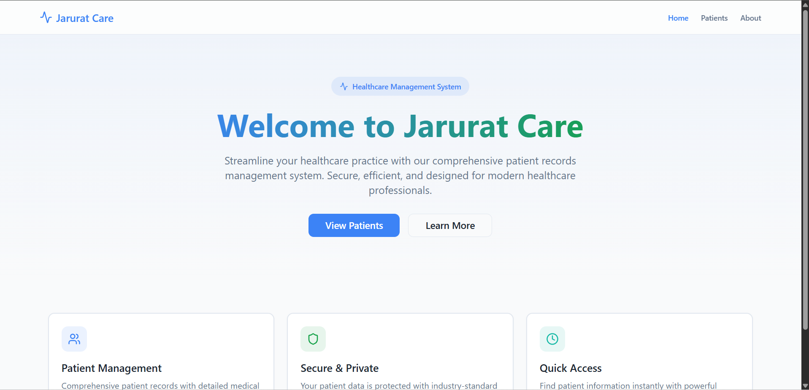
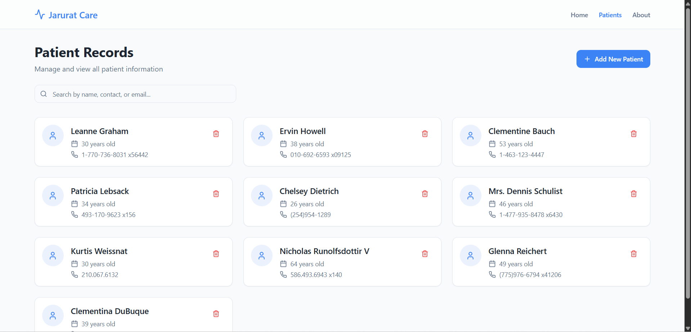

# Patient Records Dashboard

A modern, responsive patient management system built with React, TypeScript, Tailwind CSS.

## Features

- View and manage patient records
- Add new patients with detailed information
- Search and filter patients
- Responsive design for all devices
- Modern UI with dark/light mode support

## 🚀 Getting Started

### Prerequisites

- Node.js 16+ and npm
- Git

### Installation

1. Clone the repository:
   ```sh
   git clone https://github.com/yourusername/patients-records-dashboard.git
   cd patients-records-dashboard
   ```

2. Install dependencies:
   ```sh
   npm install
   ```

3. Start the development server:
   ```sh
   npm run dev
   ```

4. Open [http://localhost:5173](http://localhost:5173) in your browser.

## 📸 Screenshots




## What technologies are used for this project?

This project is built with:

- Vite
- TypeScript
- React
- Tailwind CSS